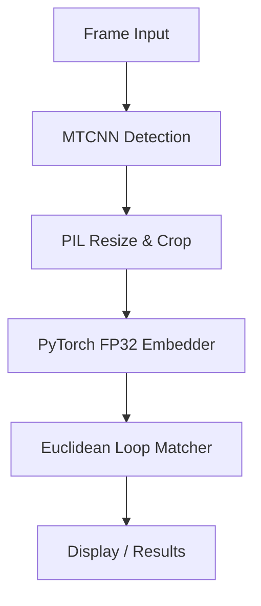
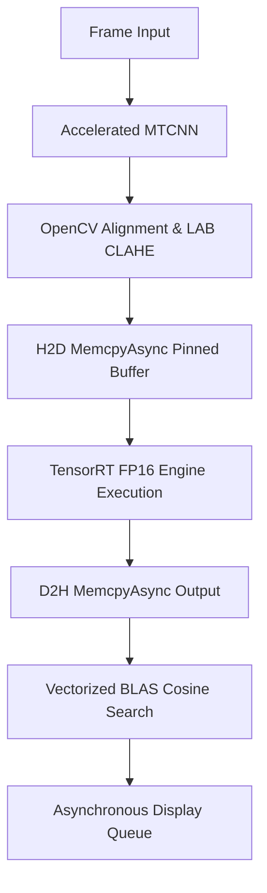

# FaceNet Benchmarking Methodology

This document outlines the architectural design, pre-processing, mathematical formulations, and statistical guidelines implemented in the benchmarking suite to compare standard and optimized pipelines on the NVIDIA Jetson AGX Orin 64GB.

---

## 1. Pipeline Execution Flows

The suite evaluates four distinct pipeline variants, each engineered to demonstrate specific levels of hardware and software optimization:

### 1.1 Variant 1: Base Pipeline (Synchronous PyTorch FP32)
- **Framework**: Standard PyTorch v2.3.0
- **Precision**: Full Precision (Float32)
- **Face Detection**: Standard MTCNN (PyTorch implementation)
- **Image Preprocessing**: Pillow (PIL) resizing using BILINEAR filtering. Converts objects to NumPy arrays on the host CPU.
- **Normalization**: Single global division: `(img_np - 127.5) / 128.0`.
- **Face Alignment**: Basic bounding box crop with padding, without rotating or deskewing coordinates.
- **Embedding Computation**: InceptionResnetV1 (vggface2 weights) running synchronously.
- **Database Search**: Euclidean distance using standard loops over database arrays: `np.linalg.norm(db - query)`.

### 1.2 Variant 2: Optimized PyTorch Pipeline (Asynchronous FP16)
- **Framework**: PyTorch v2.3.0 utilizing Tensor Cores via Half Precision (FP16).
- **Precision**: Mixed/Half Precision (Float16) where GPU support is available.
- **Face Detection**: Accelerated MTCNN using vectorized tensor resizing.
- **Image Preprocessing**: Fully vectorized OpenCV and NumPy array manipulation. Takes advantage of OpenCV's multi-threaded C++ backend.
- **Illumination Normalization**: Dynamic LAB L-channel Contrast Limited Adaptive Histogram Equalization (CLAHE).
- **Face Alignment**: 2D similarity transform (deskewing) based on 5-point face landmarks (aligning left and right eye coordinates to horizontal targets).
- **Embedding Computation**: PyTorch InceptionResnetV1 cast to half precision (`.half()`).
- **Database Search**: Vectorized BLAS-accelerated Cosine similarity: `1.0 - np.dot(db, query)`.
- **Asynchronous Processing**: Background frame capture and pre-processing queues isolate embedding execution from CPU blocking.

### 1.3 Variant 3: ONNX Runtime Pipeline (CUDA Provider)
- **Framework**: ONNX Runtime v1.17.1 utilizing the `CUDAExecutionProvider`.
- **Precision**: Mixed/Float32.
- **Face Detection & Preprocessing**: Identical to Variant 2 (OpenCV, eye alignment, CLAHE).
- **Embedding Computation**: Model exported to ONNX format with dynamic batch axes, utilizing TensorRT graph optimizations inside ONNX Runtime.
- **Database Search**: Vectorized Cosine similarity.

### 1.4 Variant 4: TensorRT Pipeline (Compiled Engine)
- **Framework**: NVIDIA TensorRT v10.x / 8.x
- **Precision**: Quantized FP16 Engine compiled directly on the target hardware (Orin) to leverage dedicated Tensor Cores.
- **Memory Management**: Preallocated page-locked (pinned) host memory and CUDA device buffers (`pycuda.driver.pagelocked_empty`) to minimize Host-to-Device (H2D) and Device-to-Host (D2H) copy overheads.
- **Asynchronous Execution**: Memory copies and kernel execution run asynchronously on non-default CUDA streams (`cuda.Stream`), synchronizing only when retrieving outputs.
- **Database Search**: Highly optimized vectorized Cosine similarity.

---

## 2. Preprocessing & Normalization Details

### 2.1 Landmark-Based Face Alignment (Deskewing)
To align a face, we compute a 2D similarity transform (rigid transformation including rotation, scaling, and translation) that maps the detected eye coordinates to predefined target positions:
- **Target Coordinates** (for a $160 \times 160$ input size):
  - Left Eye Target: \((x_{left}, y_{left}) = (0.3125 \cdot 160, 0.35 \cdot 160) = (50, 56)\)
  - Right Eye Target: \((x_{right}, y_{right}) = (0.6875 \cdot 160, 0.35 \cdot 160) = (110, 56)\)

Using the detected left eye \(P_{left}\) and right eye \(P_{right}\) landmarks:
1. **Rotation Angle**: \(\theta = \arctan2(y_{right} - y_{left}, x_{right} - x_{left})\).
2. **Scale Factor**: \(S = \frac{\text{Target Distance}}{\text{Detected Distance}} = \frac{110 - 50}{\|P_{right} - P_{left}\|_2}\).
3. **Transformation Matrix**:
   \[
   M = \begin{bmatrix}
   \alpha & \beta & (1 - \alpha) \cdot x_{center} - \beta \cdot y_{center} \\
   -\beta & \alpha & \beta \cdot x_{center} + (1 - \alpha) \cdot y_{center}
   \end{bmatrix}
   \]
   where \(\alpha = S \cdot \cos(\theta)\) and \(\beta = S \cdot \sin(\theta)\).
4. **Warping**: The transformation matrix is applied via `cv2.warpAffine` to produce a perfectly centered, rotated, and normalized face.

### 2.2 Illumination Normalization (LAB CLAHE)
Standard RGB color-space adjustments suffer from chromatic distortion when equalized. Our optimized preprocessor normalizes illumination variance by separating color from intensity:
1. Convert the BGR image to the **LAB color space**:
   \[
   \text{BGR} \xrightarrow{\text{cvtColor}} \text{LAB}
   \]
2. Split the image into channels: **L** (Lightness/Intensity), **A** (Green-Red), and **B** (Blue-Yellow).
3. Apply **Contrast Limited Adaptive Histogram Equalization (CLAHE)** on the **L channel** only:
   - **Clip Limit**: \(2.0\) (prevents over-amplification of noise in dark regions).
   - **Tile Grid Size**: \(8 \times 8\) (equalizes local contrast block-by-block).
4. Merge the modified L channel back with the original A and B channels, then convert back to BGR.

---

## 3. Embedding Distance Metrics

### 3.1 Euclidean Distance (Base Pipeline)
Given two embeddings \(\mathbf{u}, \mathbf{v} \in \mathbb{R}^{512}\):
\[
d_{Euc}(\mathbf{u}, \mathbf{v}) = \|\mathbf{u} - \mathbf{v}\|_2 = \sqrt{\sum_{i=1}^{512} (u_i - v_i)^2}
\]
*Threshold*: Standard matching limits lie between \(0.6\) and \(1.0\) (unnormalized).

### 3.2 Cosine Similarity and Distance (Optimized Pipelines)
For L2-normalized embeddings (where \(\|\mathbf{u}\|_2 = \|\mathbf{v}\|_2 = 1.0\)):
1. **Cosine Similarity**:
   \[
   s_{Cos}(\mathbf{u}, \mathbf{v}) = \mathbf{u} \cdot \mathbf{v} = \sum_{i=1}^{512} u_i v_i
   \]
2. **Cosine Distance**:
   \[
   d_{Cos}(\mathbf{u}, \mathbf{v}) = 1.0 - s_{Cos}(\mathbf{u}, \mathbf{v})
   \]
For a database matrix \(\mathbf{D} \in \mathbb{R}^{N \times 512}\) and query vector \(\mathbf{q} \in \mathbb{R}^{512}\), the search is executed as a single vectorized matrix-vector multiplication using optimized BLAS:
\[
\mathbf{d}_{Cos} = 1.0 - \mathbf{D}\mathbf{q}
\]
*Threshold*: Recommended matching limit is \(0.4\).

---

## 4. Evaluation Formulations

### 4.1 Verification Metrics
Verification is a binary classification task (same person vs. different person). At a matching threshold \(T\):
- **True Acceptance Rate (TAR) / Recall**:
  \[
  \text{TAR} = \frac{\text{TP}}{\text{TP} + \text{FN}}
  \]
- **False Acceptance Rate (FAR)**:
  \[
  \text{FAR} = \frac{\text{FP}}{\text{FP} + \text{TN}}
  \]
- **False Rejection Rate (FRR)**:
  \[
  \text{FRR} = \frac{\text{FN}}{\text{FN} + \text{TP}} = 1.0 - \text{TAR}
  \]
- **F1-Score**:
  \[
  \text{F1} = \frac{2 \cdot \text{Precision} \cdot \text{Recall}}{\text{Precision} + \text{Recall}}
  \]

### 4.2 Identification Metrics
Identification is a multi-class search problem (matching a query against an active gallery of \(N\) identities):
- **Closed-set Identification Accuracy**: The ratio of queries of registered identities correctly matched to their gallery ID under the matching threshold \(T\).
- **Open-set Unknown-rejection Rate**: The ratio of queries of unregistered/unknown identities correctly rejected (classified as unknown because distance \(\ge T\)).
